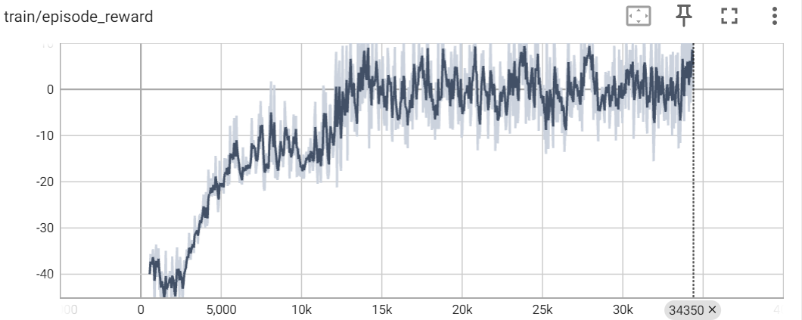
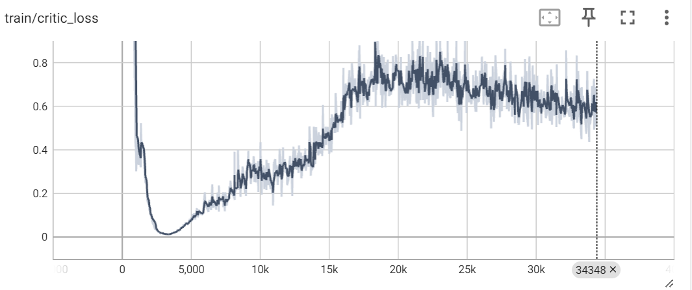
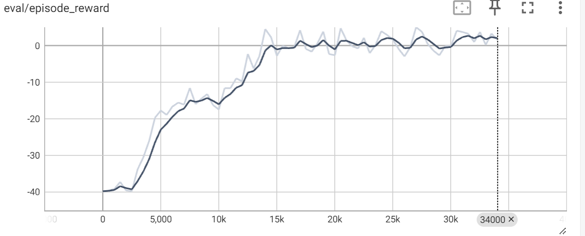
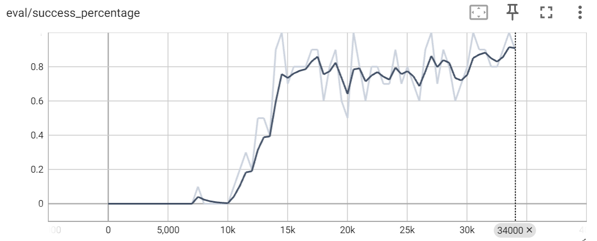
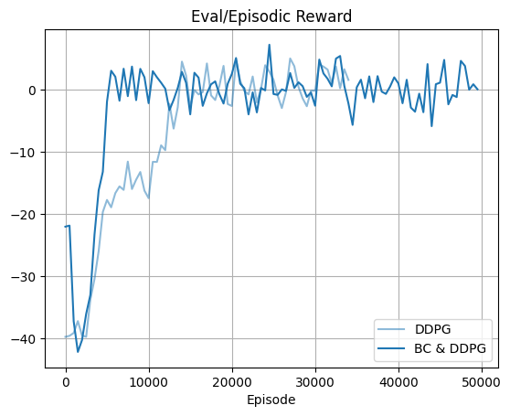
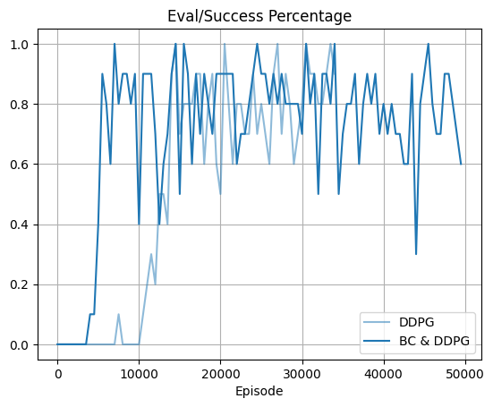

# DDPG

Actor loss keeps decreasing as the agent becomes better at finding reward

The actor starts finding non-negative episodic rewards around 15K steps

The critic initially learns a suboptimal function. This can be explained as the critic’s loss is Q-Q(target)*gamma + reward. Since the agent is initially unable to find reward, hence most of the critic’s Q predictions should be indifferent to the state, making predictions easier. Then the critic spends 5K-20K steps adjusting to its initial mistake, increasing the loss. Finally, after 20K steps, the critic’s loss starts decreasing again as the actor starts finding non-negative episodic rewards at 15K steps.

Around 15K steps eval success percentage reaches 0.8 and the episodic reward reaches 0 for both train and eval

## DDPB with Behavior Cloning

We can see that BC pre-trained DDPG reaches a success percentage of 0.8 and an episodic reward of 0 between 0-10K episodes while the vanilla DDPG policy reaches the same landmarks between 10K-20K episodes. Hence, BC pretraining helps the agent discover an optimal policy faster. 

## DDPG vs Dueling DQN and Double Q-Learning
Double Q-learning overcomes a limitation of Q-learning, which is overestimation of Q-values. This is done by separating the target network. Hence, with Double Q-learning, one network (N1) predicts the Q value given the state while the target network (N2) lags behind this network, for proving targets to update N1. 

Dueling DQN on the other hand separates the prediction into two subparts of the same network. Here, one part is responsible for predicting Advantage (Q(s,a) – V(s)) and the other part is responsible for predicting the values (V(s)). This separation helps learn a better policy over DQN when an environment has states where all actions are optimal (S1) (example certain car-racing Atari games). While on the other hand there may be states (S2) where only specific actions are optimal. Hence, this distinction between V(s) prediction and Advantage prediction helps learn features/weights, for both S1 and S2. 

Both these networks are quite different form an Actor-Critic framework like DDPG which leverages one network to predict the action given the state and another to predict the Q value given (s,a). Because of their construction, the prior two networks are not applicable in cases where the action space is continuous. For example, for our repository we work in an action space which is continuous from the agent’s perspective (although it is discrete or pixelated from the environment perspective). Hence, we would not be able to use Dueling DQN and Double DQN in this scenario without discretization.   

